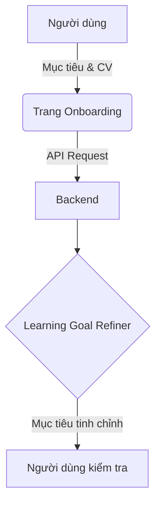
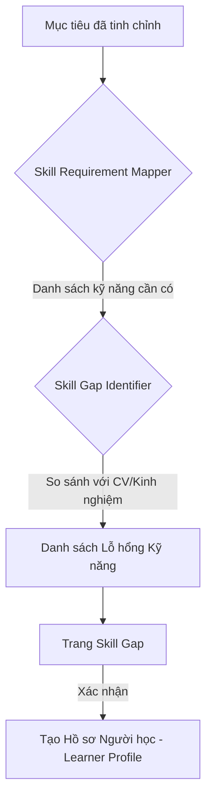
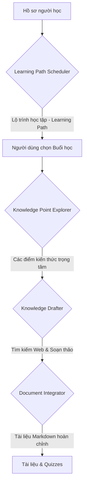

# Tài liệu Dự án GenMentor

## 1. Tổng quan Dự án
**GenMentor** là một hệ thống học tập cá nhân hóa thông minh (Intelligent Tutoring System - ITS) dựa trên trí tuệ nhân tạo (AI). Dự án được thiết kế để tạo ra trải nghiệm học tập thích nghi, tùy chỉnh theo nhu cầu, lỗ hổng kỹ năng và mục tiêu nghề nghiệp của từng cá nhân.

Hệ thống kết hợp các công nghệ AI tiên tiến như:
- **LLM (Large Language Models)**: DeepSeek, OpenAI, Claude... để tư duy và tạo nội dung.
- **RAG (Retrieval-Augmented Generation)**: Tích hợp tìm kiếm web và tài liệu cục bộ để cung cấp thông tin chính xác.
- **Agentic Workflow**: Các tác nhân AI chuyên nghiệp cộng tác để thực hiện các nhiệm vụ phức tạp.

---

## 2. Kiến trúc Hệ thống
GenMentor tuân thủ kiến trúc **Client-Server** hiện đại:

### 2.1. Frontend (Streamlit)
- Giao diện người dùng tương tác, trực quan.
- Quản lý trạng thái phiên học tập (Session State) và điều hướng giữa các trang (Onboarding, Skill Gap, Learning Path...).
- Giao tiếp với Backend thông qua các API RESTful.

### 2.2. Backend (FastAPI)
- Hệ thống điều phối (Orchestrator) các Agent AI.
- Quản lý các dịch vụ cốt lõi: LLM Factory, Search Engine, RAG.
- Cung cấp các Endpoint cho từng giai đoạn của quy trình học tập.

---

## 3. Quy trình Hoạt động Chi tiết (Workflow)

Hệ thống hoạt động qua 4 giai đoạn chính được mô tả dưới đây:

### 3.1. Giai đoạn 1: Khởi động (Onboarding)
Người dùng nhập mục tiêu học tập (ví dụ: "Muốn trở thành Senior Frontend Engineer") và cung cấp thông tin nền tảng (CV hoặc văn bản mô tả kinh nghiệm).



### 3.2. Giai đoạn 2: Phân tích Lỗ hổng Kỹ năng (Skill Gap Identification)
Đây là giai đoạn cốt lõi để cá nhân hóa.



### 3.3. Giai đoạn 3: Lập kế hoạch & Tạo nội dung (Learning Execution)
Hệ thống lên lịch trình các buổi học và tạo tài liệu chi tiết.



### 3.4. Giai đoạn 4: Thích nghi & Phản hồi (Feedback Loop)
Sau mỗi buổi học, hệ thống cập nhật hồ sơ người học để các buổi học sau trở nên hiệu quả hơn.

---

## 4. Chi tiết các Module Backend Chính

### 4.1. Skill Gap Identification
Module này chịu trách nhiệm phân tích "khoảng cách" giữa hiện tại và mục tiêu.
- **Mapper Agent**: Chuyển đổi mục tiêu trừu tượng thành các kỹ năng cụ thể và cấp độ yêu cầu.
- **Identifier Agent**: Phân tích thông tin người dùng để đánh giá cấp độ hiện tại và giải thích tại sao đó là một lỗ hổng.

### 4.2. Adaptive Learner Modeling
Xây dựng một "bản sao kỹ thuật số" của người học:
- Lưu trữ sở thích học tập (phong cách ngôn ngữ, độ khó).
- Theo dõi tiến độ và các mẫu hành vi.
- Cập nhật liên tục dựa trên phản hồi sau mỗi buổi học.

### 4.3. Personalized Resource Delivery
Tạo ra tài liệu học tập "may đo" riêng:
- **Search-Enhanced**: Tự động tìm kiếm các nguồn uy tín trên web (Sử dụng DuckDuckGo/Serper).
- **Multi-Perspective**: Khám phá một khái niệm từ nhiều góc độ khác nhau.
- **Quiz Generator**: Tạo câu hỏi trắc nghiệm, đúng/sai hoặc trả lời ngắn để kiểm tra kiến thức ngay lập tức.

### 4.4. AI Chatbot Tutor
Hỗ trợ 24/7 với khả năng nắm bắt ngữ cảnh:
- Hiểu rõ hồ sơ người học và lộ trình đang theo đuổi.
- Giải đáp thắc mắc chuyên sâu ngay tại giao diện đọc tài liệu.

---

## 5. Công nghệ & Frameworks
- **Backend**: FastAPI (Python 3.12+).
- **Frontend**: Streamlit.
- **AI Orchestration**: LangChain, Pydantic (Validation).
- **Configuration**: Hydra (Quản lý cấu hình linh hoạt qua YAML).
- **Search**: DuckDuckGo Search API.
- **LLM Connectivity**: Factory pattern hỗ trợ DeepSeek, OpenAI, Anthropic, Ollama.

---

## 6. Cấu trúc Thư mục Dự án

```text
gen-mentor/
├── backend/                  # Mã nguồn Server (FastAPI)
│   ├── main.py               # Điểm nhập ứng dụng, định nghĩa API
│   ├── api_schemas.py        # Định nghĩa kiểu dữ liệu trao đổi
│   ├── base/                 # Các thành phần cốt lõi (LLM Factory, RAG)
│   ├── modules/              # Các AI Micro-services (Skill Gap, Profiling...)
│   └── config/               # Cấu hình hệ thống (YAML)
├── frontend/                 # Mã nguồn giao diện (Streamlit)
│   ├── main.py               # Entry point giao diện
│   ├── pages/                # Các trang chức năng (Onboarding, Learning Path...)
│   ├── components/           # Các thành phần UI dùng lại
│   └── utils/                # Hàm tiện ích (giao tiếp API, xử lý PDF)
└── project_documentation.md  # Tài liệu dự án này
```

---

## 7. Hướng dẫn Vận hành
### Bước 1: Cài đặt Môi trường
```bash
# Cài đặt backend
cd backend
python -m venv .venv
source .venv/bin/activate
pip install -r requirements.txt

# Cài đặt frontend
cd ../frontend
python -m venv .venv
source .venv/bin/activate
pip install -r requirements.txt
```

### Bước 2: Cấu hình Biến môi trường
Tạo file `.env` trong thư mục `backend/` và thêm API Key:
```env
DEEPSEEK_API_KEY=your_key_here
# Hoặc OPENAI_API_KEY, etc.
```

### Bước 3: Chạy Hệ thống
1. Chạy Backend trước: `uvicorn main:app --port 5000` (trong thư mục backend).
2. Chạy Frontend: `streamlit run main.py` (trong thư mục frontend).

---
*Tài liệu này được biên soạn để hỗ trợ việc tiếp cận và phát triển dự án GenMentor.*
